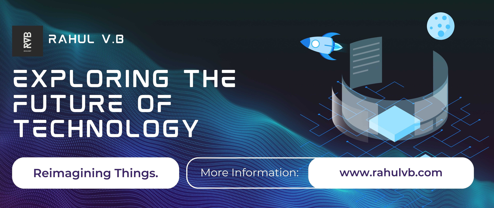

<h1 align="center">Hi 👋, I'm Rahul V.B</h1>
<h3 align="center">A CSE UG student | Tech Geek.</h3>

  

- 🔭 I’m currently leading / working on **SDMCET Insignia 2024** **www.sdmcetinsigniafest.com**

- 🤝 I’m looking for help with **expansion of QWERTY.I/O Web Application** **www.sdmcetqwertyio.com**

- 👨‍💻 All of my latest projects are available at **https://www.rahulvb.com**

- 💬 Official Contact? **www.rahulvb.com/#contact**

- 📫 How to reach me **github@rahulvb.com**

<h3 align="left">Connect with me:</h3>

 

<h2 align="center">Lᴀɴɢᴜᴀɢᴇs ᴀɴᴅ Tᴏᴏʟs</h2> 

 

<!--- 👋 Hi, I’m Rahul V.B
- 🌱 Currently studying CSE at SDMCET.
- 📫 Reach me via <a href="https://www.instagram.com/rahulvb27/">Instagram DM</a> 
&nbsp;&nbsp;&nbsp;&nbsp;&nbsp;&nbsp;&nbsp;&nbsp;&nbsp;&nbsp;
&nbsp;&nbsp;&nbsp;&nbsp;&nbsp;&nbsp;&nbsp;&nbsp;&nbsp; or <a href="https://rahulvb.com/contact">Contact Officially</a>-->
<!---
r-vb/r-vb is a ✨ special ✨ repository because its `README.md` (this file) appears on your GitHub profile.
You can click the Preview link to take a look at your changes.
--->
